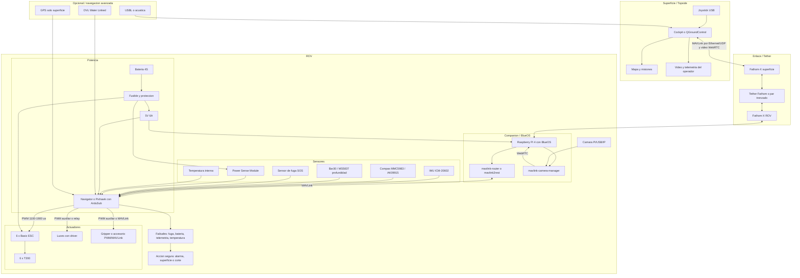

# Diagrama en bloques de ArduSub con componentes nombrados

> Basado en la documentacion leida de Cockpit/BlueOS/ArduSub y en el BOM Nivel B del proyecto.
> Convencion: bloques entre corchetes son componentes; las flechas muestran flujo principal de control, telemetria, video o energia de senal.

---

## 1. Diagrama Mermaid



---

## 2. Version ASCII compacta

```text
Joystick USB -> Cockpit/QGroundControl -> Fathom-X superficie -> tether -> Fathom-X ROV
                                                      |
                                                      v
                                   Raspberry Pi 4 + BlueOS
                                   |-- mavlink-router/mavlink2rest
                                   |-- mavlink-camera-manager -> WebRTC
                                                      |
                                                      v
                                        Navigator/Pixhawk con ArduSub
                                           |        |        |
                                        IMU/compas Bar30  Leak/PSM/Temp
                                           |
                                           v
                                    6 x Basic ESC -> 6 x T200
                                           |
                                    Aux PWM/relay -> luces/gripper

Bateria 4S -> fusible -> PSM/ESC/5V BEC -> Raspberry Pi/Navigator
Opcional: DVL/USBL/GPS -> ArduSub o GCS
Failsafes -> alarma/superficie/corte
```

---

## 3. Nombre de cada bloque y funcion

| Bloque | Nombre | Funcion |
|---|---|---|
| JS | Joystick USB | Entrada manual del piloto |
| GCS | Cockpit o QGroundControl | Estacion de control, telemetria, video y misiones |
| MAP | Mapa y misiones | Waypoints, survey y seguimiento |
| VLOG | Video y telemetria del operador | Visualizacion y registro |
| FXS/FXR | Fathom-X | Ethernet sobre un par/tether de largo alcance |
| TETH | Tether | Medio fisico de comunicacion |
| RPI | Raspberry Pi 4 + BlueOS | Companion computer, routing, video y servicios |
| M2R | mavlink-router/mavlink2rest | Puente MAVLink entre BlueOS/red y autopilot |
| CAMMGR | mavlink-camera-manager | Gestion de video si no se usa pipeline propietario |
| FC | Navigator/Pixhawk con ArduSub | Control de actitud, profundidad, motores y failsafes |
| IMU/MAG | IMU y compas | Orientacion y rumbo |
| BAR | Bar30/MS5837 | Profundidad por presion de agua |
| LEAK | Sensor de fuga | Detecta ingreso de agua |
| PSM | Power Sense Module | Mide voltaje y corriente de bateria |
| TEMP | Temperatura interna | Monitoreo termico |
| ESC | Basic ESC | Convierte PWM en potencia trifasica para motor BLDC |
| MOT | T200 | Propulsion |
| LIGHT | Luces con driver | Iluminacion controlada |
| SERVO | Gripper/accesorio | Carga util controlada |
| BATT | Bateria 4S | Energia principal |
| FUSE | Fusible/proteccion | Proteccion electrica |
| BEC | 5V 6A | Alimentacion logica para companion/autopilot |
| FS | Failsafes | Reaccion ante fuga, bateria baja, telemetria o temperatura |
| SAFE | Accion segura | Alarma, subir, detener motores o cortar segun configuracion |
| DVL/USBL/GPS | Opcional | Posicionamiento avanzado; GPS solo en superficie |

---

## 4. Referencias internas

- `diagnostico/bom-final-nivel-b.md`
- `diagnostico/componentes-nivel-b-especificaciones.md`
- `diagnostico/ardusub-adaptacion-fifish-v6.md`
- `diagnostico/informe-conversion-completa-rov.md`
